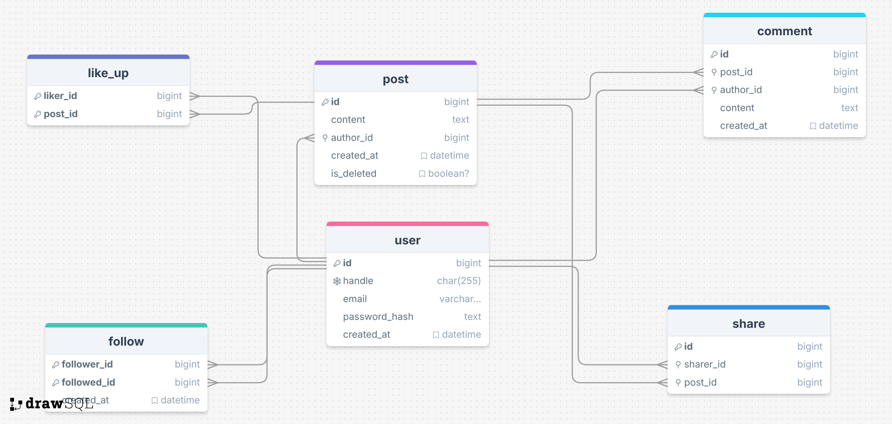

# Flask-based newsfeed microservice

To get started manipulating the data; all endpoints will be listed in the logs.

# Design

`FLASK_ENV=dev docker compose -p <some_unique_id> up -d --build`

#### Basic fetching and updating using CURL
##### User endpoints
`curl -X GET "http://your-api-url/api/v1/users/"  # Get all users`

`curl -X GET "http://your-api-url/api/v1/users/<user_id>"  # Get user by ID`

`curl -X POST "http://your-api-url/api/v1/users/" -d '{"handle": "<handle>", "email": "<email>", "password_hash": "<password_hash>"}'  # Create user`

##### Post endpoints
`curl -X GET "http://your-api-url/api/v1/posts/"  # Get all posts`

`curl -X GET "http://your-api-url/api/v1/posts/<post_id>"  # Get post by ID`

`curl -X POST "http://your-api-url/api/v1/posts/" -d '{"content": "<content>", "author_id": "<author_id>"}'  # Create post`

`curl -X PUT "http://your-api-url/api/v1/posts/<post_id>" -d '{"content": "<updated_content>"}'  # Update post`

`curl -X DELETE "http://your-api-url/api/v1/posts/<post_id>"  # Delete post`

##### Comment endpoints
`curl -X GET "http://your-api-url/api/v1/posts/<post_id>/comments"  # Get comments for post`

`curl -X GET "http://your-api-url/api/v1/posts/<post_id>/comments/<comment_id>"  # Get comment by ID`

`curl -X POST "http://your-api-url/api/v1/posts/<post_id>/comments" -d '{"content": "<content>", "author_id": "<author_id>"}'  # Create comment`

`curl -X PUT "http://your-api-url/api/v1/posts/<post_id>/comments/<comment_id>" -d '{"content": "<updated_content>"}'  # Update comment`

`curl -X DELETE "http://your-api-url/api/v1/posts/<post_id>/comments/<comment_id>"  # Delete comment`

##### Like endpoints
`curl -X GET "http://your-api-url/api/v1/posts/<post_id>/likes"  # Get likes for post`

`curl -X GET "http://your-api-url/api/v1/posts/<post_id>/likes/<like_id>"  # Get like by ID`

`curl -X POST "http://your-api-url/api/v1/posts/<post_id>/likes" -d '{"liker_id": "<liker_id>"}'  # Create like`

`curl -X DELETE "http://your-api-url/api/v1/posts/<post_id>/likes/<like_id>"  # Delete like`

##### Share endpoints
`curl -X GET "http://your-api-url/api/v1/posts/<post_id>/shares"  # Get shares for post`

`curl -X GET "http://your-api-url/api/v1/posts/<post_id>/shares/<share_id>"  # Get share by ID`

`curl -X POST "http://your-api-url/api/v1/posts/<post_id>/shares" -d '{"sharer_id": "<sharer_id>"}'  # Create share`

`curl -X DELETE "http://your-api-url/api/v1/posts/<post_id>/shares/<share_id>"  # Delete share`

##### Follow endpoints
`curl -X GET "http://your-api-url/api/v1/follows/"  # Get all follows`

`curl -X POST "http://your-api-url/api/v1/follows/" -d '{"follower_id": "<follower_id>", "followed_id": "<followed_id>"}'  # Create follow`

`curl -X GET "http://your-api-url/api/v1/follows/<followed_id>"  # Get followers for followed user`

`curl -X GET "http://your-api-url/api/v1/follows/<follower_id>"  # Get followed users for follower`
